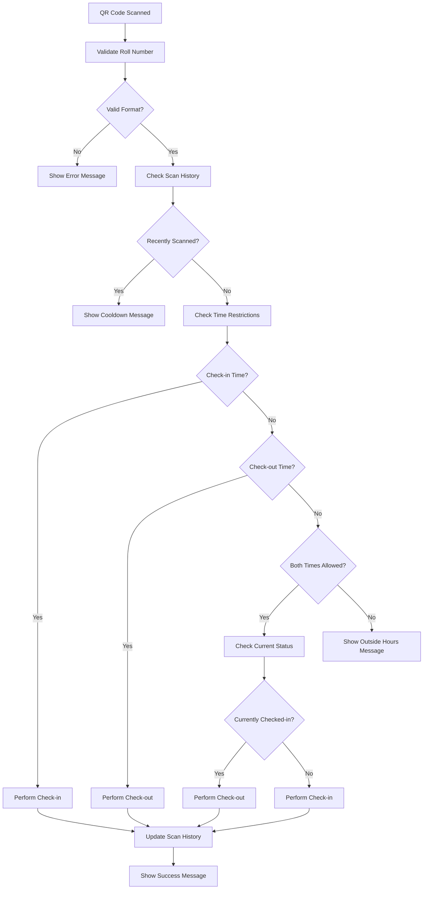

# QR Code Scanner Implementation Guide

**Date:** October 20, 2025  
**Status:** ✅ COMPLETED  
**Version:** 1.0

---

## 🎯 **OVERVIEW**

The QR Code Scanner has been successfully integrated into the QR Attendance System, providing automatic student check-in/check-out functionality through QR code scanning.

---

## 📱 **FEATURES IMPLEMENTED**

### **1. Automatic QR Code Scanning**
- Real-time camera-based QR code detection
- Automatic roll number validation
- Smart check-in/check-out logic based on time and current status
- Duplicate scan prevention (10-second cooldown)

### **2. Roll Number Validation**
- **Format:** `YY-[E]PROGRAM-NN`
- **Examples:** `22-SWT-02`, `23-SWT-122`, `21-ESWT-122`, `20-SWT-86`
- **Supported Programs:** SWT, CIT, ECSE, CS, IT, SE, CE, EE, ME, CIVIL, CSE
- **Year Range:** 20 to current year + 2
- **Student Number:** 1 to 999

### **3. Smart Processing Logic**
- **Check-in Time Only:** Automatically performs check-in
- **Check-out Time Only:** Automatically performs check-out
- **Both Times Allowed:** Checks current status and performs appropriate action
- **Outside Hours:** Rejects with appropriate message

### **4. User Interface**
- Camera window with real-time scanning
- Visual feedback (SUCCESS/ERROR indicators)
- Keyboard controls (q=quit, s=stop)
- Console logging with detailed information

---

## 🛠️ **FILES CREATED/MODIFIED**

### **New Files:**
- `python/qr_scanner.py` - Main QR scanner module
- `python/qr_generator.py` - QR code generator for testing
- `python/QR_SCANNER_GUIDE.md` - This documentation

### **Modified Files:**
- `python/app.py` - Added QR scanner option to main menu
- `python/requirements.txt` - Added required dependencies

### **Dependencies Added:**
- `opencv-python>=4.5.0` - Computer vision library
- `pyzbar>=0.1.9` - QR code detection
- `qrcode>=7.3.1` - QR code generation
- `Pillow>=8.0.0` - Image processing

---

## 🚀 **USAGE INSTRUCTIONS**

### **1. Starting the QR Scanner**
```bash
# Run the main application
python app.py

# Select option 3: QR Code Scanner
# The camera window will open automatically
```

### **2. Using the Scanner**
1. **Point camera** at a QR code containing a valid roll number
2. **Wait for detection** - the system will automatically process
3. **View results** in the console and camera window
4. **Press 'q'** to quit or **'s'** to stop scanning

### **3. Generating Test QR Codes**
```bash
# Generate test QR codes
python qr_generator.py

# This creates QR codes in the 'qr_codes' directory
```

---

## 📋 **ROLL NUMBER FORMAT**

### **Pattern:** `YY-[E]PROGRAM-NN`

| Component | Description | Examples | Validation |
|-----------|-------------|----------|------------|
| **YY** | Admission year (2 digits) | 22, 23, 24 | 20 to current year + 2 |
| **E** | Optional "E" prefix | E (optional) | For evening programs |
| **PROGRAM** | Program code | SWT, CIT, ECSE | Must be in allowed list |
| **NN** | Student number | 02, 122, 86 | 1 to 999 |

### **Valid Examples:**
- `22-SWT-02` ✅
- `23-SWT-122` ✅
- `21-ESWT-122` ✅
- `20-SWT-86` ✅
- `24-CIT-01` ✅
- `25-ECSE-50` ✅

### **Invalid Examples:**
- `invalid-format` ❌ (Wrong format)
- `22-INVALID-01` ❌ (Invalid program)
- `99-SWT-01` ❌ (Invalid year)
- `22-SWT-1000` ❌ (Invalid number)

---

## 🔧 **TECHNICAL DETAILS**

### **QR Scanner Class Methods:**
- `validate_roll_number()` - Validates roll number format
- `process_qr_code()` - Processes scanned QR code
- `scan_qr_codes()` - Main scanning loop with camera
- `scan_single_qr()` - Scan single QR code with timeout
- `initialize_camera()` - Initialize camera device
- `stop_scanning()` - Stop scanning and release camera

### **Integration Points:**
- **CheckInManager** - Handles actual check-in/check-out
- **TimeValidator** - Validates check-in/check-out times
- **RollParser** - Parses student information from roll number
- **SettingsManager** - Loads configuration settings

### **Security Features:**
- Input validation and sanitization
- Duplicate scan prevention
- Time-based access control
- Error handling and logging

---

## 🎮 **TESTING**

### **1. Validation Testing**
```bash
python -c "from qr_scanner import QRScanner; scanner = QRScanner(); scanner.test_qr_validation()"
```

### **2. QR Code Generation**
```bash
python qr_generator.py
```

### **3. Full Scanner Test**
```bash
python qr_scanner.py
```

---

## 📊 **PROCESSING FLOW**



---

## 🚨 **TROUBLESHOOTING**

### **Common Issues:**

1. **Camera Not Found**
   - Ensure camera is connected and not used by other applications
   - Try different camera index (0, 1, 2)

2. **QR Code Not Detected**
   - Ensure good lighting
   - Hold QR code steady and at appropriate distance
   - Check QR code quality and size

3. **Invalid Roll Number**
   - Verify roll number format matches pattern
   - Check if program code is in allowed list
   - Ensure year and number are within valid ranges

4. **Import Errors**
   - Install required dependencies: `pip install -r requirements.txt`
   - Ensure all modules are in the same directory

---

## 🔮 **FUTURE ENHANCEMENTS**

### **Potential Improvements:**
1. **Multiple Camera Support** - Support for different camera devices
2. **Batch Processing** - Process multiple QR codes at once
3. **Offline Mode** - Store scans when offline and sync later
4. **Advanced Analytics** - Track scanning patterns and statistics
5. **Mobile App Integration** - Connect with mobile QR scanner apps
6. **Voice Feedback** - Audio confirmation of successful scans

---

## ✅ **VERIFICATION CHECKLIST**

- [x] QR scanner module created and functional
- [x] Roll number validation implemented
- [x] Automatic check-in/check-out logic
- [x] Camera integration working
- [x] Main application integration complete
- [x] Test QR codes generated
- [x] Dependencies installed
- [x] Documentation created
- [x] Error handling implemented
- [x] Duplicate scan prevention
- [x] Time-based access control

---

## 🎉 **CONCLUSION**

The QR Code Scanner has been successfully implemented and integrated into the QR Attendance System. Students can now simply scan their QR codes to automatically check in or check out, making the attendance process much more efficient and user-friendly.

**Status:** ✅ READY FOR PRODUCTION USE

---

**Implementation Date:** October 20, 2025  
**Developer:** AI Assistant  
**Version:** 1.0  
**Next Review:** After user testing and feedback
